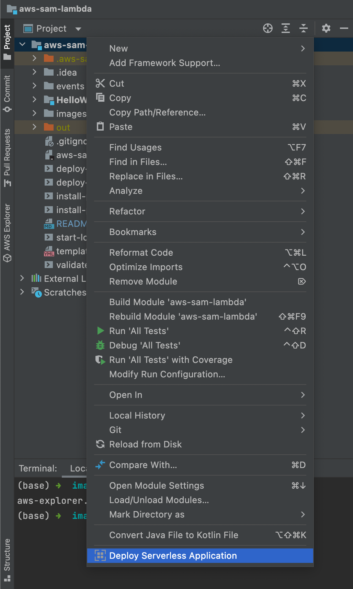
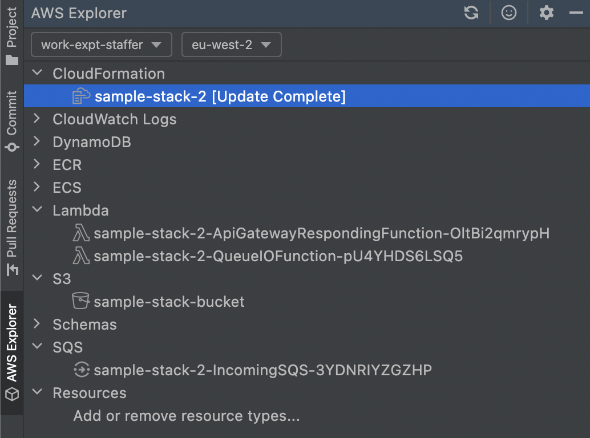

# aws-sam-lambda

This is an experimental repository, a number of scripts will help you
to build and deploy a serverless application to AWS or to localstack.

This serverless application contains:

* An API endpoint
* A lambda that responds to the API endpoint
* An SQS queue
* An SNS topic
* A lambda that reads from the SQS queue and posts to an SNS topic

A number of scripts provided in this repository illustrate how to perform
common serverless build and deploy actions. 

## HelloWorldFunction directory

This actually contains 2 lambda functions:

* `ApiGatewayrespondingApp` - responds to `GET` method at an http endpoint.
* `QueueIOApp` - copies SQS queue messages into an SNS topic.

## Prerequisites

Assumed, you already have Docker installed.

* `install-prerequisites-aws-sam-cli.sh`
* `install-prerequisites-localstack-cli.sh`

## Setup accounts

The [AWS Toolkit](https://docs.aws.amazon.com/toolkit-for-jetbrains/latest/userguide/welcome.html)
provides an easy way to select a current AWS profile in the bottom right corner of IntelliJ.
It has a handy menu option called **Edit Credential Files**.

_If you haven't already,_ create an IAM User with an access key.
This will be used in a named profile that the AWS CLI and
IntelliJ AWS Toolkit plugin can use to deploy your application for you.

Put it in a group with the following policies:

* `AdministratorAccess` - allows it to create and deploy resources.
* `AmazonS3FullAccess` - allows it to create, read and write to S3 buckets.

Now put this user's credentials into a named profile on your system:

* Documentation: [Connect to an AWS account](https://docs.aws.amazon.com/toolkit-for-jetbrains/latest/userguide/key-tasks.html#key-tasks-first-connect)
* Edit the `credentials` and `config` files, and add a [named profile](https://docs.aws.amazon.com/cli/latest/userguide/cli-configure-profiles.html).
* This profile should provide the `aws_access_key_id` and `aws_secret_access_key` for an IAM user in your account (not the root user).

NB. these files can also be found in: `~/.aws`

## Validate and build

Validate the SAM `template.yaml` against a named AWS profile with:

* `validate-remote.sh`

Either build the project within IntelliJ, or:

```bash
cd HelloWorldFunction
gradle build
```

or

```bash
sam build
```

## Testing

```bash
cd HelloWorldFunction
gradle test
```

## Invoke a lambda locally (without localstack)

Build, and test by providing a custom event, with `sam local invoke`:

```bash
sam build
sam local invoke HelloWorldFunction --event events/event.json
```

To emulate the API, use `sam local start-api`. It'll run on port 3000:

```bash
sam local start-api
curl http://localhost:3000/
```

## Build and deploy to AWS

Either, use the [AWS Toolkit](https://docs.aws.amazon.com/toolkit-for-jetbrains/latest/userguide/welcome.html)
which provides a **Deploy Serverless Application** option:



Alternatively:

* `deploy-remote.sh`

This will offer a guided deployment, and save configuration to: `samconfig.toml`

## Explore AWS resources

After deployment, you'll be given a list of resources in the new stack.

You can also explore the AWS account using the web interface,
or AWS Explorer in IntelliJ 
(provided by the [AWS Toolkit](https://docs.aws.amazon.com/toolkit-for-jetbrains/latest/userguide/welcome.html)).



## Build and deploy to localstack

* `start-localstack.sh`
* `deploy-localstack.sh`

## View remote logs from AWS

Tail remote logs with `sam logs`:

```bash
sam logs -n QueueIOFunction --stack-name aws-sam-lambda --tail
```

This uses the logical name of the function (as found in `template.yaml`)
to look up and tail the appropriate logs from CloudWatch.

You could also do it through the AWS web interface.

## Cleanup

To delete the sample application that you created, use the AWS CLI. Assuming you used your project name for the stack name, you can run the following:

```bash
aws cloudformation delete-stack --stack-name aws-sam-lambda
```
